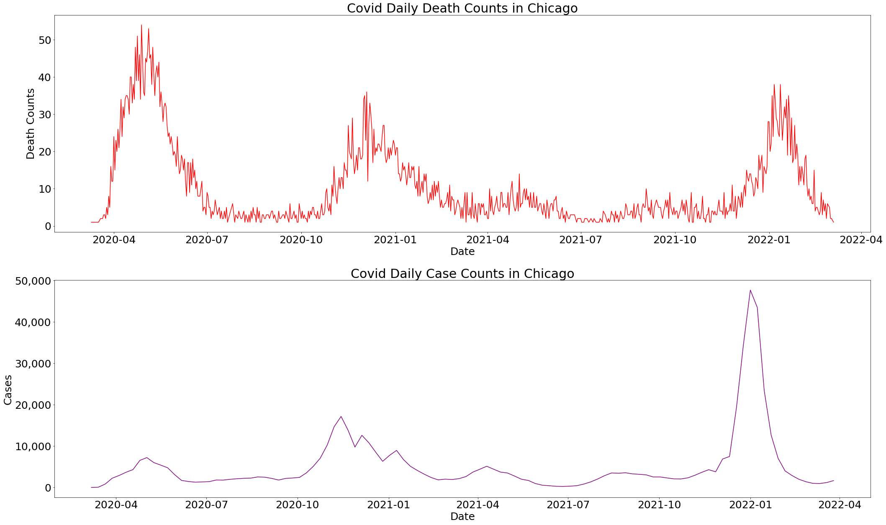
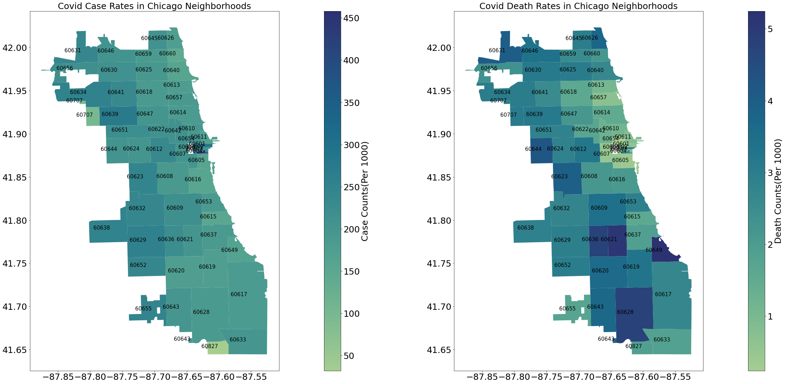
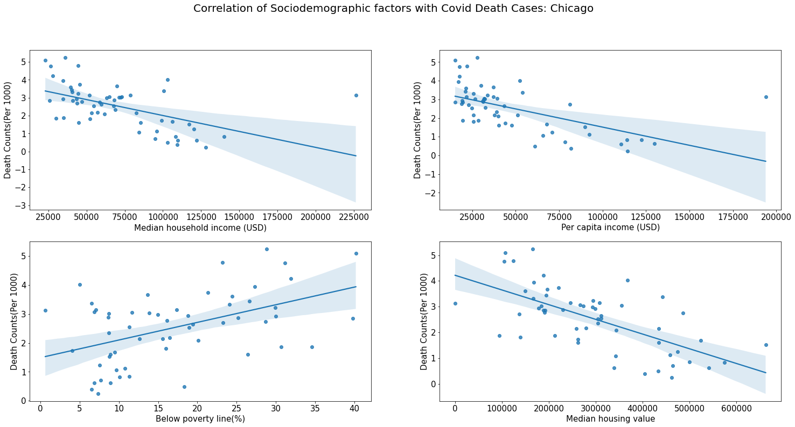
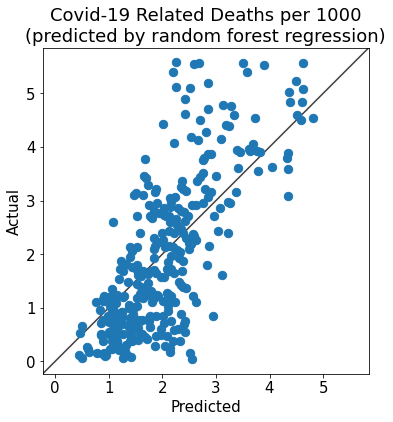
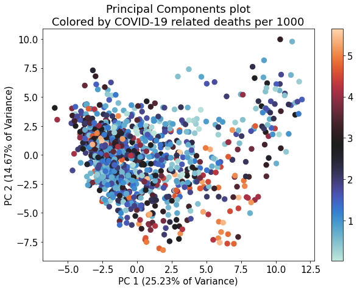

# Modelling the Pandemic

The aim of this project was to model the impact of COVID-19 in Chicago neighborhoods, using sociodemographic data (age, income, education etc.) and COVID-19 statistics (hospitalizations, deaths etc.). The sociodemographic and COVID-19 data used here is for each ZIP code.

### Data Collection & Wrangling

The following steps were performed to clean the dataset.

- Collecting Covid death and case data for individual zipcodes, while sociodemographic data was available for counties or census tracts. To align granularity, sociodemographic data was scraped based on zipcodes from the Census Reporter [website](https://censusreporter.org/profiles/86000US60607-60607/).
- For Chicago, instances with 'Manner of Death' as 'ACCIDENT' or 'SUICIDE' were removed from the Covid death data.
- Chicago's zipcode-based boundary data, used for visualizing Covid impact on individual zipcodes, was obtained from the Chicago Data Portal. Instances where zipcodes were outside Chicago were removed from both Covid death and case data.
- Date columns were converted to datetime type.
- Unnecessary columns were removed from both Covid case and death datasets.
- Covid deaths and cases were aggregated for all zipcodes.
- Covid deaths and cases were merged with Sociodemographic data.
- Normalization of Covid deaths and cases was performed by each zipcode's population, resulting in values rounded to two decimal points (cases per 1,000 / deaths per 1,000).

### Exploratory Data Analysis & Visualization

**Time series analysis.** In the beginning of 2022, number of cases nearly rose to 50,000 per day which was far more than the initial Covid outbreak.

**Geospatial analysis.** The neighborhood with zipcode 60604 had the most number of covid cases per 1,000 population. Regarding covid death rates, Chicago's south side is more affected than the north.

**Correlation analysis:** It is evident, that there is some correlation with economic standing of a neighboorhood and the impact of Covid 19.

### Data Modeling
**Random forest regression** (RFR) model was used to predict COVID-19 deaths per capita as a function of sociodemographic variables in each zipcode. The RFR was poor at predicting extreme values (death rates that were either zero or much higher than usual). Therefore, the final model is trained on data filtered to remove zipcodes with death rates of either zero or greater than the 95th percentile. This resulted in a training error rate of 0.29 deaths per thousand people and a test error rate of 0.78 deaths per thousand people.

**Principal components analysis** (PCA) was used to help visualize the distribution of COVID-19-related death rates in the multivariate sociodemographic dataspace. There is not an obvious pattern in the distribution of death rates over the first two principal components. One reason for this may be that the zipcodes represented here include several different types of areas (e.g., rural, urban, and suburban) and the relationship between sociodemographic variables and COVID-19 death rates may not be consistent across all of these areas.

### Takeaways
- Household income and housing value have a negative correlation with Covid death rate, while poverty level has a positive correlation with Covid death rate.
- The percentage of people taking public transit to work seemed to be the most important feature in predicting Covid across the cities and states.
- Other important features include ethnicity, owning vs renting, population density, poverty level and housing value.
- Our random forest regresison model predited Covid deaths with a training error rate of 0.29 (deaths per 1000) and a test error rate of 0.78 (deaths per 1000) on the new dataset.
- The model can be further improved by breaking it down by the type of area it is predicting Covid death rates for (urban or rural).

To get more details about the project look into this [notebook](https://github.com/uic-cs418/cs418-spring22-bored-grad-yacht-club/blob/main/CS418_final_report.ipynb) and [ppt](https://github.com/uic-cs418/modeling-the-pandemic/blob/main/Reports%20%26%20Presentations/CS418_final_presentation.pdf).

**Group**: Bored Grad Yacht Club

### Team Members:
Kazi Shahrukh Omar
Christopher Owen
Abdul Rafey Siddiqui
Nguyen Hoa Pham
Gautam Kushwah
